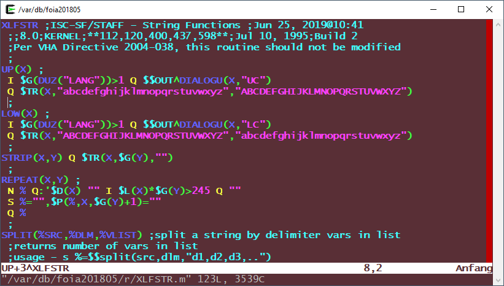
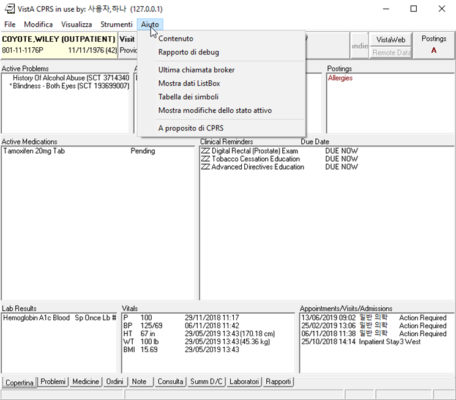
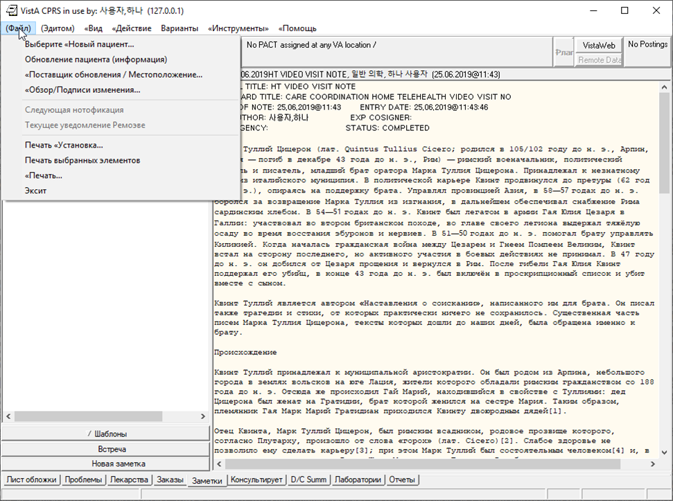
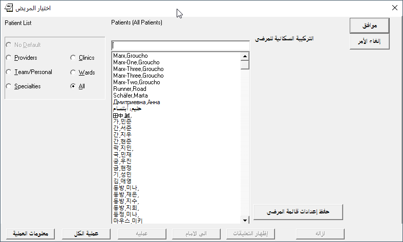
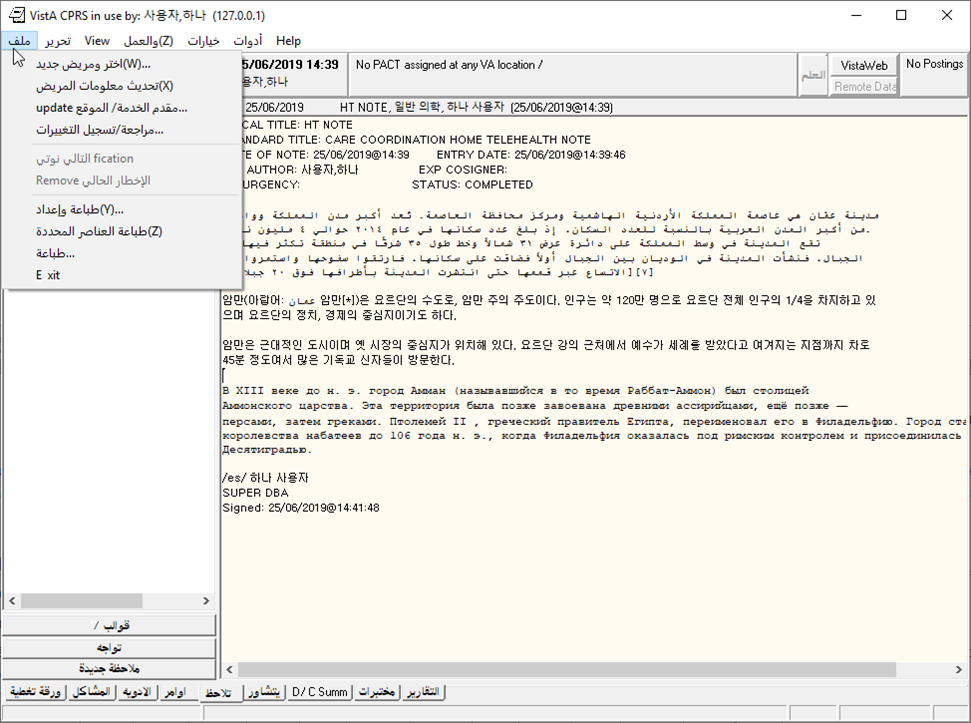
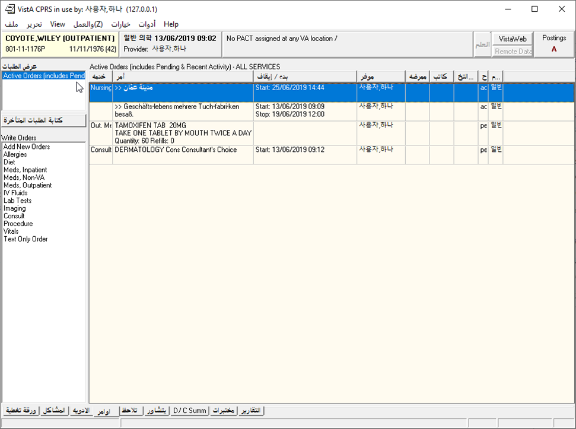
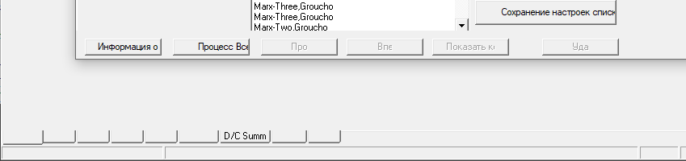

Plan VI Arabic (& others) Phase
===============================

**Sam Habiel, Pharm.D.**/
**OSEHRA**/
**6 Aug 2019**

This is the last blog post in the Plan-VI project. We describe how to apply the
work of the last year to new languages. We also take the opportunity as well to
show VistA CPRS with a few of these languages. We have previously shown Korean
and German. In this post, we will show:

- French
- Italian
- Russian
- Arabic

Unfinished Business
-------------------
In the previous blog post (`here <http://smh101.com/articles/p6/plan6-german-phase.html>`__,
or `mirrored here <https://www.osehra.org/post/plan-vi-summary-german-phase>`__),
I mentioned that I would leave the exercise of uppercasing/lowercasing non-English
languages as an exercise to the reader. However, in preparing a demo for Russian,
I needed the code in order for Russian to uppercase properly.

So here it is. You need to add code to the Language file (#.85) and modify
XLFSTR. For the language file portion, the code differs between Caché and GT.M/
YottaDB. The code is as follows that needs to be added to the Language file:

============  ==========                    ===============   =============
Field Number  Field Name                    Caché Code        GT.M/YDB Code
============  ==========                    ===============   =============
10.4          Uppercase Conversion          S Y=$ZCVT(Y,"U")  S Y=$ZCO(Y,"U")
10.5          Lowercase Conversion          S Y=$ZCVT(Y,"L")  S Y=$ZCO(Y,"L")
============  ==========                    ==========        =============

And here is the modified XLFSTR (now committed to the plan-vi repo):

   XLFSTR with Case Conversions

The added lines are::

  UP+1: I $G(DUZ("LANG"))>1 Q $$OUT^DIALOGU(X,"UC")
  LOW+1: I $G(DUZ("LANG"))>1 Q $$OUT^DIALOGU(X,"LC")

Steps for Implementing CPRS in your own Language
------------------------------------------------
1. Copy CPRSChart.lng file, appending a suffix before .lng for the two letter
   language name. E.g. CPRSChart.ar.lng for Arabic.
2. Translate the strings after the = sign starting at line 9. For demonstration
   purposes, I used a routine I wrote (`UDEP6TRA
   <https://github.com/OSEHRA-Sandbox/VistA-M/blob/plan-vi/Packages/Germany%20Specific%20Modifications/Routines/UDEP6TRA.m>`__) to do machine translations of the
   file.
3. Create Language file entries for DI, DD, FMTE, LC, and UC for the language.
   More on that in the next section.
4. Set language in VistA in the DEFAULT LANGUAGE (#207) field in the KERNEL
   SYSTEM PARAMETERS file (#8989.3); or alternately you can set it at the user
   level in the LANGUAGE (#200) field in the NEW PERSON (#200) file.

Language file (#.85) Entries
----------------------------
For the language that you plan to use, you need to set-up the following fields
in the language file, as appropriate to your language:

============            ==========                    ==========
Field Name              Field Number                  Short Name
============            ==========                    ==========
Date/Time Format        10.2                          DD
Date/Time Format (FMTE) 10.21                         FMTE
Date Input              20.2                          DI
Uppercase Conversion    10.4                          UC
Lowercase Conversion    10.5                          LC
============            ==========                    ==========

If your language does not have case, there is no need for you to fill UC and
LC.  DI will tend to be always the same for most languages (the only exception
is that if you already use the US date format in your country; if that case,
just leave it blank). And you always put the same code in FMTE as DD.
Practically then, you only need to modify DD/FMTE to for each language.

Let's discuss what you need to put in:

UC & LC: discussed above.

DI: ``S:$G(%DT)'["I" %DT=$G(%DT)_"I" G CONT^%DT``

DD & FMTE: These differ by date output format for language. Here are the
languages we put into VistA and their FMTE:

========  ===========  =========
Language  Date Format  DD & FMTE
========  ===========  =========
German    dd.mm.yyyy   ``S:Y Y=$S($E(Y,6,7):$E(Y,6,7)_".",1:"")_$S($E(Y,4,5):$E(Y,4,5)_".",1:"")_($E(Y,1,3)+1700)_$P("@"_$E(Y_0,9,10)_":"_$E(Y_"000",11,12)_$S($E(Y,13,14):":"_$E(Y_0,13,14),1:""),"^",Y[".")``
French    dd/mm/yyyy   ``S:Y Y=$S($E(Y,6,7):$E(Y,6,7)_"/",1:"")_$S($E(Y,4,5):$E(Y,4,5)_"/",1:"")_($E(Y,1,3)+1700)_$P("@"_$E(Y_0,9,10)_":"_$E(Y_"000",11,12)_$S($E(Y,13,14):":"_$E(Y_0,13,14),1:""),"^",Y[".")``
Italian   dd/mm/yyyy   ``S:Y Y=$S($E(Y,6,7):$E(Y,6,7)_"/",1:"")_$S($E(Y,4,5):$E(Y,4,5)_"/",1:"")_($E(Y,1,3)+1700)_$P("@"_$E(Y_0,9,10)_":"_$E(Y_"000",11,12)_$S($E(Y,13,14):":"_$E(Y_0,13,14),1:""),"^",Y[".")``
Russian   dd.mm.yyyy   ``S:Y Y=$S($E(Y,6,7):$E(Y,6,7)_".",1:"")_$S($E(Y,4,5):$E(Y,4,5)_".",1:"")_($E(Y,1,3)+1700)_$P("@"_$E(Y_0,9,10)_":"_$E(Y_"000",11,12)_$S($E(Y,13,14):":"_$E(Y_0,13,14),1:""),"^",Y[".")``
Arabic    dd/mm/yyyy   ``S:Y Y=$S($E(Y,6,7):$E(Y,6,7)_"/",1:"")_$S($E(Y,4,5):$E(Y,4,5)_"/",1:"")_($E(Y,1,3)+1700)_$P("@"_$E(Y_0,9,10)_":"_$E(Y_"000",11,12)_$S($E(Y,13,14):":"_$E(Y_0,13,14),1:""),"^",Y[".")``
Korean    yyyy/mm/dd   ``S Y=$$FMTE^UKOUTL(Y,$G(%F))``
========  ===========  =========

Patient Registration
--------------------
I did nothing special here. I registered a few patients with non-Engilsh names
for testing: SCHÄFER,MARTA (German), ДМИТРИЕВНА,АННА (Cyrillic), and
حليم,أبتسام (Arabic). Our changes from the Korean phase of the project to the
DPTLK* and XLFNAME* routines that handle name entry needed no further
improvements.

Screenshots
-----------
Here are some screenshots I have taken with various languages.

.. figure::
   images/screenshots-01-french.png
   :align: center
   :alt: French Cover Sheet

   French Cover Sheet

    Italian Cover Sheet

   Russian Notes Tab

   Patient Selection show patients in Multiple Languages

   
   Arabic Notes Tab with Note containing Mutiple Languages

   Arabic Orders Tab
   
Side note: I had an unexpected problem with Russian, seen in this screenshot:

   Blank labels on Tabs when the text on the tabs is Russian.
   
This turned out to be a `previously reported problem
<https://www.ghisler.ch/board/viewtopic.php?t=45290>`__ with the font "MS Sans
Serif". Apparently it is not a true type font; surprisingly, changing the
font of the bottom tabs to the similarly named "Microsoft Sans Serif" fixes the
problem.
