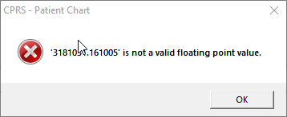
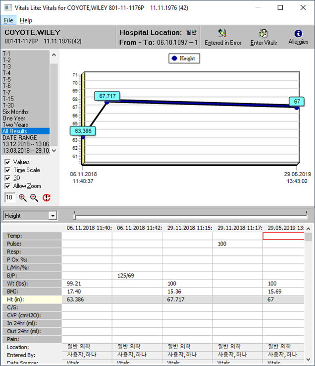
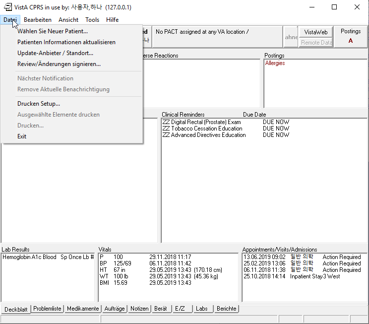

Plan VI German Phase
====================

**Sam Habiel, Pharm.D.**/
**OSEHRA**/
**Mo, 24. Jun 2019 10:26:15**

Per the original schedule for the project, there are only 3 weeks allocated for
working on adapting German to VistA. As a result, I chose to dedicate these
three weeks into CPRS, as this is what would be the most common exposure for
most users trying it in Germany. To that end we focused on the following topics:

- CPRS currently crashes when run in any MS Windows Locale that use commas
  instead of dots as a decimal separator. This is actually true for half of the
  countries in the world, according to `Wikipedia
  <https://en.wikipedia.org/wiki/Decimal_separator>`__; actually, by land mass,
  most countries seem to use a comma rather than a dot.
- This wasn't expected to take time: we needed to confirm that the changes for
  date handling made for Korean will be equally applicable to German.
- Previously, to save time, since we just focused on Korean, we hardcoded the
  Korean translation file into the CPRS exe. The objective here is to change
  the code so that CPRS will display the correct language based on the Windows
  locale.
- And, lastly, we wanted for a demo to show CPRS with German Labels

For our discussions below, for commit references, the repos are:

- `OSEHRA-Sandbox/VistA <https://github.com/OSEHRA-Sandbox/VistA>`__.
- `OSEHRA-Sandbox/VistA-M <https://github.com/OSEHRA-Sandbox/VistA-M>`__.

Name and Numberspace
--------------------
We didn't need to use these except for one routine. The namespace for Germany
in the VistA/RPMS world is UDE and the numberspace is 276.000.000 (inclusive)
to 277.000.000 (exclusive).

Decimal Comma Project
---------------------
CPRS currently crashes when run in any MS Windows Locale that use commas
instead of dots as a decimal separator. 

   CPRS Crashing on a Fileman Date that contains a dot for comma separtor

As apparent from the screenshot above, the issue has to do with parsing
strings into Floating numbers and the reverse. The cause of the issue is that
VistA sends data (primarily Fileman dates, Vitals & lab data) with a dot for
the decimal separator. In Windows locales, where a comma is the decimal
separator, parsing it into a number does not work. We picked the German locale 
to demonstrate this issue; but we could have equally picked Norwegian, Italian,
or French.

Investigation reveals that the issue happens in four Delphi functions/procedures
relating to Floating Point conversion:

- ``StrToFloat``
- ``FloatToStr``
- ``FloatToStrF``
- ``TextToFloat``

There were three potential options on how this can be fixed.

1. Change data types to string rather than floats. This would have necessitated
   large amounts of code changes on the CPRS side, especially since many of the
   data types were used in function/method signatures.
2. Send the data from M with commas instead of dots for decimal points. Perhaps
   we can argue that this is the most correct way of dealing with this problem.
   However, this necessitates an unimaginably large amount of code changes on
   the M side. Also, M has no concept of datatype at storage - therefore you
   cannot tell if the data that needs to be converted into a number is really
   numeric or not. Fileman can supply that information; but I am sure most CPRS
   calls are not going through Fileman; so that's not an option. I did check
   to see if Fileman had existing code to format decimals appropriately based
   on language; and it surprisingly does not.
3. Our last option - each of the Delphi calls that crash accept a parameter
   specifying which locale to use when interpreting a float. So ``StrToFloat(x)``
   becomes ``StrToFloat(x, TFormatSettings.Create('en-US'))`` to interpret a
   float using en-US locale. 
   
The last option, while affecting a large amount of files, was in the end the
easiest way to solve this problem. Sed was used to automate the changing of the
code. Here's what the sed script looked like for ``StrToFloat`` and
``FloatToStr``.

.. code:: bash
  
  for f in $(ack -li 'StrToFloat\([^\),]+\)');do sed -i -E "s/(StrToFloat)\(([^\),]+)\)/\1\(\2, TFormatSettings.Create\(\'en-US\'\)\)/g" $f; done
  IFS=$'\n'; for f in $(ack -l 'FloatToStr\([^\),]+\)'); do sed -i -E "s/(FloatToStr)\(([^\),]+)\)/\1\(\2, TFormatSettings.Create\(\'en-US\'\)\)/g" "$f"; done
  git status --short | cut -d " " -f 3-8 | xargs unix2dos.exe

We needed to do this in the Vitals project as well. In total, 95 files were
modified.

The commits are in the OSEHRA-Sandbox/VistA repo:

- OSEHRA-Sandbox/VistA@7d2948
- OSEHRA-Sandbox/VistA@426887
- OSEHRA-Sandbox/VistA@53f355
- OSEHRA-Sandbox/VistA@9e74bd
- OSEHRA-Sandbox/VistA@e88bec
- OSEHRA-Sandbox/VistA@621a38

Presentation of Dates
---------------------
A lot of issues that deal with dates in CPRS were extensively discussed `here
<https://www.osehra.org/post/cprs-date-display-and-summary-phase-1>`__ and
`duplicated here <http://smh101.com/articles/p6/cprs-dates.html>`__. Our work
here is to validate that the same changes will work on the German locale.

Happily that was indeed the case. The code to handle German dates on Fileman
already existed; so we didn't need to write it -- however, it had three
p Our work
here is to validate that the same changes will work on the German locale.

Happily that was indeed the case. The code to handle German dates on Fileman
already existed; so we didn't need to write it -- however, it had three
problems that needed to be fixed:

1. Fileman has a redundant date node in the language file in "FMTE" in addition
   to "DD". That needed to be filled out.
2. The DD code needs to put an "@" between the date & time rather than a space.
   If you don't do that, %DT cannot parse the date back. While as mentioned in
   the extensive date changes blog post linked to earlier, problem list &
   vitals both have the problem of relying on what I call "round-tripping" of
   dates (sending external dates & then receiving them back and expecting to
   be able to parse them) -- I found the issue inside the M code in the
   Scheduling package when it tries to retrieve appointments: it converted
   dates to external form and parsed them back to validate them.
3. The date parser entry for German was not there.

There's a commit in the VistA-M repo to fix this: OSEHRA-Sandbox/VistA-M@8391a1.

The fields in the language file that need to be changed are:

============  ==========                    =========
Field Number  Field Name                    Entry
============  ==========                    =========
10.2          Date/Time Format              ``S:Y Y=$S($E(Y,6,7):$E(Y,6,7)_".",1:"")_$S($E(Y,4,5):$E(Y,4,5)_".",1:"")_($E(Y,1,3)+1700)_$P("@"_$E(Y_0,9,10)_":"_$E(Y_"000",11,12)_$S($E(Y,13,14):":"_$E(Y_0,13,14),1:""),"^",Y[".")``
10.21         Date/Time Format (FMTE)       ``S:Y Y=$S($E(Y,6,7):$E(Y,6,7)_".",1:"")_$S($E(Y,4,5):$E(Y,4,5)_".",1:"")_($E(Y,1,3)+1700)_$P("@"_$E(Y_0,9,10)_":"_$E(Y_"000",11,12)_$S($E(Y,13,14):":"_$E(Y_0,13,14),1:""),"^",Y[".")``
20.2          Date Input                    ``S:$G(%DT)'["I" %DT=$G(%DT)_"I" G CONT^%DT``
============  ==========                    =========

Here's a screenshot of Vitals with the German Dates and Decimal Comma. I am
aware that some numbers are not parsed and still show the dot in the number for
a decimal point. This is an issue that can be easily solved by parsing these
numbers, but it's not something I pursued given the limited amount of time.

   Demo showing German Dates and Decimal Comma

Using the Translation Framework across Locales
----------------------------------------------
Previously, our work to use the translation framework hardcoded Korean as the
language. Now we use the Win32 ``GetLocaleInfo`` call with flags
``LOCALE_USER_DEFAULT`` and ``LOCALE_SNAME`` to get a Unix style locale code
like "de-DE" for German in Germany; or "de-CH" for German in Switzerland. We
now take the first piece ("de") and set that as the translation file in the
Kryvich framework when CPRS starts up (the full translation file name would be
CPRSChart.de.lng). This way CPRS changes its display language based on the
Windows display language. Here is the Delphi code:

.. code:: pascal

  function GetWindowsLanguage(LCTYPE: LCTYPE {type of information}): string;
  var
    Buffer : PChar;
    Size : integer;
  begin
    Size := GetLocaleInfo (LOCALE_USER_DEFAULT, LCType, nil, 0);
    GetMem(Buffer, Size);
    try
      GetLocaleInfo (LOCALE_USER_DEFAULT, LCTYPE, Buffer, Size);
      Result := string(Buffer);
    finally
      FreeMem(Buffer);
    end;
  end;

...and

.. code:: pascal

  {$IFDEF KRYVICH}
  var
    sLocale, sUserLang, sLangFile: string;
  {$ENDIF}

  begin
    if not BorlandDLLVersionOK then exit;         // Exit immediately if old or missing BORLNDMM.DLL
  //    RegisterCPRSTypeLibrary;                      // will halt program if /regserver or /unregserver param
    Application.Initialize;

  {$IFDEF KRYVICH}
    sLocale := GetWindowsLanguage(LOCALE_SNAME);
    sUserLang := Piece(sLocale, '-', 1);
    sLangFile := 'CPRSChart.' + sUserLang + '.lng';
    FreeLocalizer.AutoTranslate := True;
    FreeLocalizer.LanguageFile := sLangFile;
  {$ENDIF}

Since in our project the start-up happens in the project file (.dpr) which is
generated by CMake, I needed to redo the .dpr.in file. The commits in the repo
are as follows:

- OSEHRA-Sandbox/VistA@76e713
- OSEHRA-Sandbox/VistA@288e29

Generating the German Language File
-----------------------------------
The above change will load the German translation for CPRS at runtime -- if one
exists. I created one quickly using the `Microsoft Translate API 
<https://www.microsoft.com/en-us/translator/business/translator-api/>`__ using
`this code <https://github.com/OSEHRA-Sandbox/VistA-M/blob/plan-vi/Packages/Germany%20Specific%20Modifications/Routines/UDEP6TRA.m>`__. The result is `this file
<https://github.com/OSEHRA-Sandbox/VistA/blob/plan-vi/Packages/Order%20Entry%20Results%20Reporting/CPRS/CPRS-Chart/Translations/kryvich/CPRSChart.de.lng>`__. Here's a CPRS
Screenshot with the German:

   CPRS with German Labels

Issues found that were not Addressed
------------------------------------
As described in the `Decimal Comma Project`_ section above, the decimal comma
issue on the M side was not addressed.
Uppercasing/Lowercasing functions in VistA were not modified. They currently
can handle ASCII only. Use vendor $Z functions ($ZCO for GT.M-YDB/$ZCVT for
Caché) in the two places that VistA does uppercasing (XLFSTR & DILIBF) will
easily solve the problem. Discussions are underway to add the $Z functions to
the Fileman Operating System file in order for Fileman code in the language
file to be runnable on all systems.

Final Outputs
-------------
The CPRS exe and the Vitals Entry dll have been updated with the changes to
handle decimal commas and the changes to dynamically load the language file
based on the Windows user locale. They can be found `here
<https://github.com/OSEHRA-Sandbox/VistA/releases/download/cprs31a-utf8-d/CPRSChart-Plan6-decimal-comma.zip>`__. All the changes are backwards compatible with the previous
version of CPRS that was released.

The repos have been updated with the latest code, but there is no new KIDs file
or new docker image at this moment.

- `OSEHRA-Sandbox/VistA <https://github.com/OSEHRA-Sandbox/VistA>`__.
- `OSEHRA-Sandbox/VistA-M <https://github.com/OSEHRA-Sandbox/VistA-M>`__.
